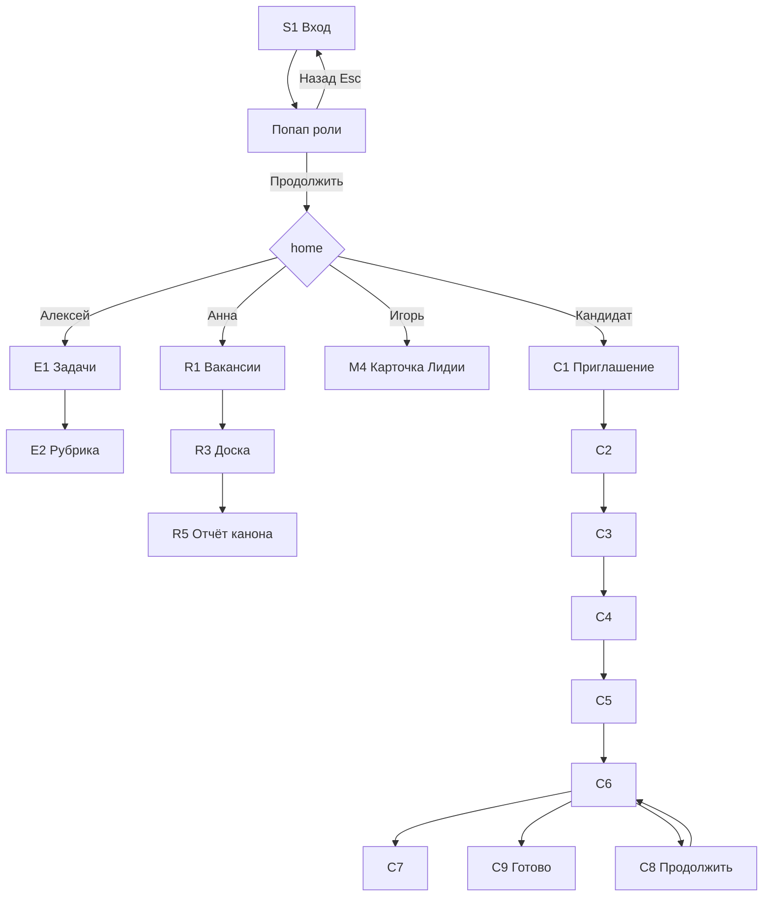

# Каталог экранов прототипа

Снято **4 сентября 2026** по коду `frontend/` (Next.js App Router). Это описание **как сейчас устроено**, не целевой продукт с сервером.

Живой стенд: `http://localhost:3001` (иногда Next занимает другой порт). Открывать как `localhost`, не `127.0.0.1`.

Контракт маршрутов и коды экранов (S1, C1, R3…): [`specs/005-evidence-interview-ui/contracts/ui-routes.md`](../specs/005-evidence-interview-ui/contracts/ui-routes.md). Полировка демо 006: [`specs/006-prototype-ux-pass/`](../specs/006-prototype-ux-pass/).

**Что это не описывает:** бэкенд, агент интервью, оценка по записи. Данные — моки в `frontend/lib/demo/`. Состояния и атомы — [`ui-atoms-and-design-system.md`](ui-atoms-and-design-system.md). Всё вместе (продукт + токены + экраны + виджеты) — [`prototype-handbook.md`](prototype-handbook.md).

---

## 1. Архитектура UI

### 1.1 Слои

```
Браузер
  └── app/layout.tsx          единственный Next-layout
        ThemeProvider         светлая/тёмная, localStorage napoleon-theme
        └── page.tsx          сама выбирает оболочку
              ├── AppShell              рекрутер / эксперт / менеджер / админ
              ├── CandidateShell        путь кандидата /i/…
              ├── BrandMark + свой header   вход, бриф
              └── голый workspace          403 / 404 / expired
```

Вложенных `layout.tsx` нет. Middleware и `redirects` в `next.config.ts` нет. Редиректы в коде:

- `/` → `/login`
- `/interview/[token]` → `/i/[token]`

### 1.2 Два каркаса и «голые» страницы

| Каркас | Кто видит | Из чего состоит |
|---|---|---|
| **AppShell** | Сотрудник | Узкий сайдбар (логотип + пункты nav), топбар (заголовок раздела, «К выбору роли», луна/солнце), `<main class="workspace">` |
| **CandidateShell** | Кандидат | Логотип + название вакансии, **степпер** из 7 шагов, контент (~720px), строка помощи (почта, Telegram, «К выбору роли») |
| **BrandMark only** | Вход, бриф менеджера | Логотип вручную, без сайдбара |
| **Без оболочки** | 403, 404, истёкшая ссылка | `PageHeader` + одна кнопка «Вернуться ко входу» |

Nav для AppShell задаёт страница:

- `recruiterNav()` — «Вакансии» → `/vacancies`
- `expertNav()` — задачи, рубрика, комплект, **аудит**, **утверждение**
- `managerNav()` — «К встречам» → `/manager`, Лидия
- `adminNav()` — все вкладки сотрудников без дублей (вакансии, доска, эксперт, менеджер, бриф, пилот, доп. вопрос Лидии); подсветка самого длинного совпавшего пути

На рубрике и комплекте вопросов в сайдбар иногда склеивают recruiter+expert.

**LaptopGate** (ширина ≤ 900px): вместо интервью показывает «Откройте с ноутбука». Стоит на проверке устройства, правилах, тренировке, вопросах, уточнении, resume. На приглашении (C1) гейта нет: узкий экран видит приглашение и кнопку «Прислать ссылку».

### 1.3 Повторяющиеся куски экрана

| Кусок | Файл | Зачем |
|---|---|---|
| `PageHeader` | `components/chrome/PageHeader.tsx` | Путь мелким, большой h1, описание, слот кнопок |
| `ScreenState` | `components/chrome/ScreenState.tsx` | loading / empty / error: заголовок, текст, действие |
| `Modal` | `components/evidence/Drawer.tsx` | Центр, Esc, крестик, клик по серому фону закрывает; клик по карточке не закрывает |
| `Drawer` | тот же файл | Панель справа, Esc + клик по фону |
| `ToastStack` | тот же файл | Пачка сообщений справа снизу, без кнопки закрыть |
| `Button` | `components/ui/button.tsx` | Единственный компонент в духе shadcn (Radix Slot) |
| `AiNote` / `HumanNote` | `components/evidence/AiNote.tsx` | Блок «система предлагает» / решение человека |
| `EvidenceLink` | `components/evidence/EvidenceLink.tsx` | Цитата + таймкод → мини-плеер |
| `PilotBadge` | `components/chrome/VersionTag.tsx` | Плашка «Пилот» |
| `VersionTag` | тот же файл | «рубрика v2 · комплект v2 · модель …» |

Вёрстка почти вся в `app/product.css`. Токены (цвета, кегли `--text-path` … `--text-h1`) — `app/globals.css`. Tailwind подключён, экраны на нём почти не собраны.

### 1.4 Где живут данные (нет сервера)

| Что | Где |
|---|---|
| Роли, тексты попапа, куда вести после входа | `lib/demo/roles.ts` |
| Одна вакансия Middle+ Python | `lib/demo/vacancies.ts` (`id`: `python-middle`) |
| Три полных кандидата с отчётами | `lib/demo/candidates.ts` (токены `dmitry`, `nikita`, `lida`) |
| Семь карточек канбана | `lib/demo/pipeline.ts` |
| Рубрика и вопросы | `lib/demo/rubric.ts` |
| Выбранная роль | `sessionStorage` → `napoleon-demo-role` |
| Прогресс интервью | `sessionStorage` → `napoleon-candidate-session:{token}` |
| Приглашения и решения рекрутера | `sessionStorage` → `napoleon-recruiter-store` |
| Тема | `localStorage` → `napoleon-theme` |

---

## 2. Роли и типичные пути

Вход **S1** `/login`: семь карточек. Клик открывает попап (кто вы / что увидите / первое действие). «Продолжить» записывает роль и ведёт на `homePath`. «Назад» / Esc роль не записывают.

| Роль | Человек | Куда попадает | Зачем жюри |
|---|---|---|---|
| Рекрутер | Анна Ковалёва | `/vacancies` | Список → доска → отчёт Лидии |
| Эксперт | Алексей С. | `/expert` | Задачи, оттуда рубрика / комплект / аудит / утверждение |
| Менеджер | Игорь Матвеев | `/manager/lida` | Одностраничник перед встречей |
| Кандидат | Дмитрий Козлов | `/i/dmitry` | Сильный сценарий |
| Кандидат | Никита Белов | `/i/nikita` | Слабый сценарий |
| Кандидат | Лидия Орлова | `/i/lida` | Серый: «недостаточно данных» |
| Админ | Ольга Белова | `/vacancies` | Сайдбар со всеми разделами сотрудников, включая доп. вопрос |

С любого экрана с оболочкой: **«К выбору роли»** → `/login` и сброс роли.



**Канбан:** Марина приглашена, Павел проходит, Елена в обработке, Дмитрий/Никита/Лидия в «Отчёт готов», Олег решён. Отчёт открывается **только** у трёх канонических в «Отчёт готов».

**MVP** — то, что показывают как рабочий путь. **Пилот** — маршрут есть, помечен «Пилот», часть кнопок disabled / тост «в пилоте это макет». Админку `/admin` не делали.

---

## 3. Каталог экранов

Ниже для каждого экрана: адрес, файл, код из контракта 005, режим, оболочка, **что человек видит**, структура блоков, куда идёт.

### 3.1 Вход и служебные

#### `/` — корень

- **Файл:** `app/page.tsx` · сервер · редирект на `/login`
- На экране ничего нет.

#### S1 `/login` — вход

- **Файл:** `app/login/page.tsx` · клиент · BrandMark + PageHeader
- **На экране:** заголовок «Вход»; пояснение, что почта не нужна; **семь карточек** (роль + имя + одна строка «что увидите»); сноска «демо».
- **Структура:** сетка `.login-grid` → клик → `Modal` с тремя абзацами и кнопками «Продолжить» / «Назад к ролям».
- **Куда:** `homePath` роли (таблица выше).

#### S2 `/403` — нет доступа

- **Файл:** `app/403/page.tsx` · сервер · без shell
- **На экране:** «Нет доступа», зачем так, кнопка во вход.

#### S2 `/404` и глобальный `not-found`

- **Файлы:** `app/404/page.tsx`, `app/not-found.tsx`
- **На экране:** «Страницы нет», кнопка во вход.

#### S2 `/i/expired` — ссылка просрочена

- **Файл:** `app/i/expired/page.tsx` · сервер
- **На экране:** срок (8 сентября), почта рекрутера Анны, кнопка во вход.

#### `/interview/[token]` — старый адрес

- Только редирект на `/i/[token]`.

---

### 3.2 Рекрутер

#### R1 `/vacancies` — список вакансий

- **Файл:** `app/vacancies/page.tsx` · AppShell (рекрутер)
- **На экране:** заголовок «Вакансии»; кнопка «Новая вакансия»; вкладки Активные / Черновики / На проверке / Архив.
- **Активные:** одна строка Middle+ Python, грейд, статус, рубрика, **счётчик словами** («приглашены 1 · проходят 1 · …»), эксперт. Клик по названию → доска.
- **Другие вкладки:** честный empty («в этом демо нет») + ссылка к активным.

#### R2 `/vacancies/new` — новая вакансия

- **Файл:** `app/vacancies/new/page.tsx` · AppShell
- **На экране:** три шага.
  1. Описание: название, грейд, менеджер, эксперт; «Извлечь требования» (пауза 2 с, имитация); «Отмена».
  2. Две колонки обязательное/желательное, задачи, стек, стоп-факторы; «Назад» / дальше.
  3. Куда отправить: менеджеру → `/brief/python-middle`; эксперту → `/vacancies/python-middle/rubric`.
- Не отдельная сущность: после отправки — существующая демо-вакансия.

#### R3 `/vacancies/python-middle` — доска / список

- **Файл:** `app/vacancies/[id]/page.tsx` · AppShell
- **Ошибка:** неизвестный `id` → ScreenState «Вакансия не найдена».
- **Шапка:** путь Вакансии / Middle+ Python; h1 «Кандидаты»; статус Активна; «+ Пригласить»; «⋯ Настройки».
- **Подсказка:** смотреть колонку «Отчёт готов».
- **Тулбар:** зелёная точка «Приём ответов открыт»; переключатель **Доска / Список**; VersionTag.
- **Доска:** пять колонок `.kanban` (Приглашены, Проходят, Обработка, Отчёт готов, Решено). В карточке имя, статус словами, у канона в ready — ссылка «Открыть отчёт».
- **Список:** те же люди, стадия подписана, без битой ссылки на отчёт у ранних стадий.
- **R4 модалка приглашения:** имя, почта, превью письма, «Отправить» / «Скопировать ссылку» (`/i/{token}`), тосты.

#### R8 `/vacancies/[id]/settings` — настройки · **пилот**

- PageHeader + PilotBadge; блоки Общее / Версии / Письма (макет); «К доске».

#### R5 `/vacancies/[id]/candidates/[cid]` — технический отчёт

- **Файл:** `app/vacancies/[id]/candidates/[cid]/page.tsx` · AppShell
- **Ошибка:** нет кандидата → «Отчёт не найден».
- **Шапка:** Кандидаты / имя; h1 «Технический отчёт»; длительность, дата; VersionTag; **Кратко / Подробно**.
- **Тело:**
  - AiNote: что предлагает система (словами, без балла).
  - Плашка «недостаточно данных» (у Лидии) — смысл + что делать человеку.
  - Три колонки: сильные / риски / не проверено.
  - Прокторинг одной строкой (не влияет на оценку).
  - Слева карта требований (статус-точка, название, уровень); справа вывод + цитата (`EvidenceLink`).
- **Нижняя панель решения:** комментарий менеджеру; «Передать менеджеру»; «Запросить доп. ответ» (модалка, пустое поле нельзя отправить; после отправки на отчёте остаётся ссылка «Открыть ссылку для кандидата» → `/i/{token}/extra/{id}`); «Не продвигать» (Modal, не `confirm`); «Экспорт в ATS» (пилот); «Посмотреть как менеджер» → `/manager/{id}`.

---

### 3.3 Эксперт

#### E1 `/expert` — задачи · **пилот**

- AppShell эксперта; три карточки: калибровка (→ рубрика), аудит, утверждение. В меню: задачи, рубрика, комплект, аудит, утверждение.

#### E2 `/vacancies/[id]/rubric` — рубрика · MVP, только чтение

- Индекс требований слева, карточка критерия справа; disabled «Редактировать» / «Утвердить»; ссылка на комплект вопросов.

#### E4 `/vacancies/[id]/questions` — комплект вопросов · MVP, только чтение

- Матрица покрытия; предупреждение про Celery; список вопросов; disabled «Добавить» / «Утвердить».

#### E5 `/vacancies/[id]/approve` — утверждение версии · **пилот**

- Баннер, diff v1/v2, кнопка «Утвердить v2» кликабельна и показывает тост «В пилоте это макет».

#### E6 `/audit/[vacancyId]` — аудит · **пилот**

- Сравнение цитаты и вывода, радио Да/Нет/Спорно, «Сохранить аудит» даёт тост-макет.

---

### 3.4 Менеджер и бриф

#### M3 `/manager` — список · **пилот**

- Таблица кандидатов, «Открыть» → одностраничник.

#### M4 `/manager/[cid]` — одностраничник перед встречей · MVP

- Последнее решение рекрутера (`HumanNote`); блоки: что подтвердилось / о чём поговорить / сильная сторона / после встречи; кнопки Берём / Ещё этап / Нет; печать. **Прокторинга нет** (так задумано).

#### M1 `/brief/[id]` — бриф вакансии · **пилот**

- Без AppShell: BrandMark + «К выбору роли»; 5 вопросов по одному; прогресс-полоса; textarea; «Ответить голосом» → тост макета; Назад / Следующий / на 5-м «Собрать требования».

#### M2 `/brief/[id]/confirm` — подтверждение профиля · **пилот**

- Две колонки обязательное/желательное из рубрики; «Назад»; «Подтвердить и передать эксперту» → `/vacancies/{id}/rubric`.

---

### 3.5 Кандидат `/i/{token}`

Токены демо: `dmitry` | `nikita` | `lida`. Неизвестный токен на любом шаге → ScreenState «Ссылка не найдена» + «К выбору роли».

Степпер (подсвечен текущий): Приглашение → Согласие → Проверка → Правила → Тренировка → Вопросы 1-5 → Готово.

#### C1 `/i/[token]` — приглашение

- Loading «Загружаю…», затем факты: ~25 мин, 5 вопросов, дедлайн; «Как устроено»; Можно / Нельзя / Устройство.
- Если сессия уже сдана → `/done`; если прервана посреди вопросов → `/resume`.
- CTA: «Начать» → согласие. На узком экране вместо этого «Прислать ссылку на почту».

#### C2 `/i/[token]/consent` — согласие

- Текст про запись; чекбоксы аудио (обязателен) и видео (по желанию); ящик с полным текстом; Назад / Продолжить.

#### C3 `/i/[token]/check` — проверка устройства · LaptopGate

- Имитация записи 5 секунд, волны, чекбокс «только текст», статус соединения; «Всё работает» → правила.

#### C4 `/i/[token]/rules` — правила · LaptopGate

- Нумерованный список 1–8; «Понятно, к тренировке»; иногда «Пропустить тренировку» → вопрос 1.

#### C5 `/i/[token]/practice` — тренировка · LaptopGate

- Пометка, что не оценивается; запись тренировочного ответа; «К первому вопросу».

#### C6 `/i/[token]/q/[n]` — вопрос · LaptopGate

- Прогресс, формулировка, прослушать / переформулировать, таймер подумать + заметки, голос или текст, отправка.
- Нет вопроса / битый номер → «Вопрос не найден».
- После части вопросов — уточнение C7; в конце — `/done`.

#### C7 `/i/[token]/q/[n]/follow-up` — уточнение · LaptopGate

- Короткий follow-up, тот же выбор голос/текст. Если `followUpText` в данных пустой, в заголовке запасной текст: «Нужно уточнить один момент по этому ответу».

#### C8 `/i/[token]/resume` — продолжить после обрыва · LaptopGate

- «Продолжить интервью» → текущий номер вопроса из session.

#### C9 `/i/[token]/done` — отправлено

- «Интервью отправлено»; что будет сегодня / до даты / позже; ссылки на транскрипт, итог (пилот), дополнительный вопрос (пилот) и запрос удаления.

#### C10 `/i/[token]/extra/[id]` — доп. ответ · **пилот**

- Заглушка вопроса; запись disabled; «в пилоте это макет»; назад к done.
- Входы: админ-меню «Доп. вопрос (пилот)», ссылка с экрана done, ссылка на отчёте после запроса доп. ответа.

#### C11 `/i/[token]/transcript` — транскрипт · заглушка

- Текст «позже»; назад к done.

#### C12 `/i/[token]/result` — итог для кандидата · **пилот**

- Бейдж Пилот; требования **названиями** (не id вроде `async`); решение рекрутера зашито; назад к done.

#### C13 `/i/[token]/request` — запрос удаления / пересмотра · **пилот**

- Переключатель, textarea, «Отправить» (локально «отправлено»).

---

## 4. Сводка: какой экран в какой оболочке

| Оболочка | Экраны |
|---|---|
| AppShell рекрутер | R1 список, R2 новая, R3 доска, R5 отчёт, R8 настройки |
| AppShell эксперт | E1 задачи, E2 рубрика, E4 вопросы, E5 approve, E6 аудит |
| AppShell менеджер | M3 список, M4 одностраничник |
| AppShell админ | те же экраны сотрудников + бриф и итог кандидата из сайдбара |
| CandidateShell | C1–C13 кроме expired |
| + LaptopGate | C3–C8 |
| BrandMark | S1 вход, M1–M2 бриф |
| Без оболочки | `/`, 403, 404, not-found, expired, редирект `/interview` |

Всего **33** `page.tsx` + `not-found.tsx`.

---

## 5. Как читать этот файл дальше

- Меняешь маршрут или оболочку — поправь **этот документ** и контракт [`ui-routes.md`](../specs/005-evidence-interview-ui/contracts/ui-routes.md).
- Поведение продукта (не моки) — [`artifacts/00-canon/PRODUCT_SPEC.md`](artifacts/00-canon/PRODUCT_SPEC.md).
- Роадмап «склеить с сервером» — [`roadmap.md`](roadmap.md).
- Состояния и атомы (кнопки, модалка, канбан, какую библиотеку брать) — [`ui-atoms-and-design-system.md`](ui-atoms-and-design-system.md). Каталог экранов — только этот файл.
