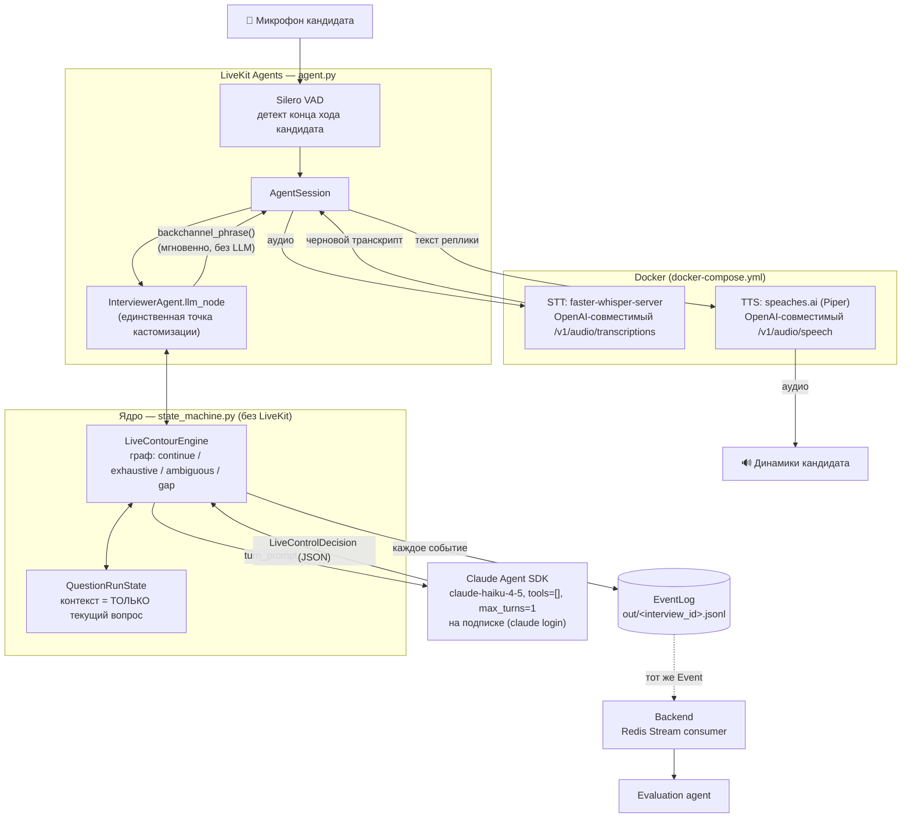
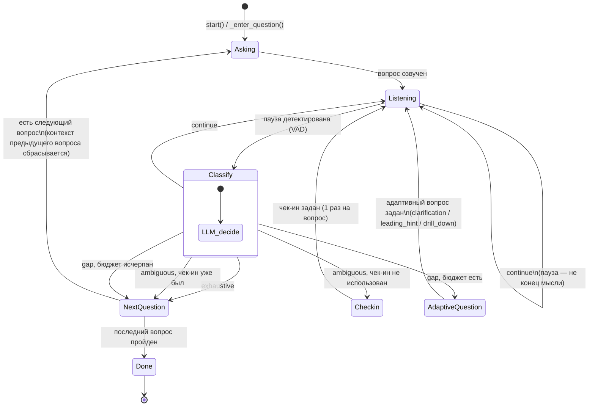

# Live-контур ИИ-интервьюера

Первая реализация одного из двух контуров системы (см. корневой
[docs/Архитектура и дизайн MVP.md](../docs/Архитектура%20и%20дизайн%20MVP.md), раздел 3):
голосовой агент, который ведёт техническое интервью в реальном времени — задаёт вопросы,
слушает кандидата, реактивно решает, когда перейти дальше, когда уточнить, а когда дать
подсказку. Не считает итоговых оценок — это работа batch-контура, которого пока нет.

## Правила для тех, кто это редактирует

См. [CLAUDE.md](CLAUDE.md) — короткий список неотменяемых решений (граф без tool-calling,
контекст только текущего вопроса, бюджеты в коде, конкретная модель и т.д.), чтобы не
переоткрывать уже сделанный выбор при следующей правке.

## Два контура — коротко

- **Live-контур (этот код)** — реальное время, черновой ASR, бюджет по времени в единицы
  секунд. Ведёт диалог и пишет протокол событий.
- **Batch-контур (не реализован)** — асинхронно после интервью: точный ASR, LLM-оценка по
  рубрике, `skill_scores`/`verdict` (раздел 5.1 архитектурного документа). Читает
  протокол событий, который пишет live-контур, — это единственная точка стыка.

## Архитектура



## Граф live-контура

Реализован в `state_machine.py` как явный конечный автомат — Python-код, не LLM с тулами.
На каждой паузе кандидата один вызов `LiveControlLLM.decide()` классифицирует реплику и
(если нужно) формулирует одну фразу; куда идти дальше — решает код, не модель.



Подробности каждой ветки — раздел 2.3.1 архитектурного документа; в коде — те же имена
(`Decision`, `GapType` в `schema.py`).

### `format="live_coding"` — фаза решения задачи

Диаграмма выше — обычный voice-вопрос. Для вопроса с `Question.format == "live_coding"`
`_enter_question()` уходит не в `Listening`, а в отдельную `Phase.CODING`: кандидат решает
задачу в редакторе кода на фронте, а не отвечает голосом сразу. У этой фазы свой system
prompt (`prompts.CODING_SYSTEM_PROMPT`) и свой, более узкий набор решений LLM —
`continue` (кандидат думает, ничего не говорим), `gap`/`gap_type=coding_hint` (кандидат сам
сказал, что застрял, либо надолго замолчал и не меняет код — LLM формулирует содержательную
подсказку) и `coding_done` (кандидат явно сказал, что готов объяснять решение — «я закончил»,
«готово» и т.п.; переход голосом, без отдельной кнопки). Обнаруживает затишье и просит у LLM
подсказку сам `agent.py` (`_question_timer_loop`), опрашивая `code`/`dialogue` на изменения.

Код кандидата доезжает до live-agent через уже существующий командный Redis-канал
(`live-agent:commands:{interview_id}`, тот же, что и кнопка «Дальше») — backend публикует
`{"type": "code_update", "content": ...}` на каждый `candidate_input` с `input_format=code`
(см. `interview_ws.py`); `LiveContourEngine.update_code()` просто держит последнюю версию.

По голосовому `coding_done` или по истечении `estimated_duration_sec` (`force_finish_coding`)
движок переходит из `Phase.CODING` к фазе объяснения на том же вопросе — дальше это обычный
реактивный цикл (`on_candidate_final_turn`, основной `SYSTEM_PROMPT`), которому в контекст
дополнительно попадает написанный код (это код ЭТОГО ЖЕ вопроса, не нарушает правило
«контекст только текущий вопрос» — см. ниже). У обеих фаз этого вопроса — свои жёсткие
per-question лимиты, отдельные от общих `adaptive_budget_remaining`/`hint_used` voice-вопросов:
не более `CODING_HINT_LIMIT` (3) подсказок во время решения и не более `CODING_FOLLOWUP_LIMIT`
(3) доп. вопросов на фазе объяснения (`state_machine.py`).

## Почему граф — код, а не LLM с тулами

Открытый вопрос из постановки задачи: нужны ли агенту тулы (`next_question`, тулы для
диалога) — **решение: без тулов**. Весь control flow — обычный Python в
`state_machine.py`: бюджеты (1 чек-ин, 1 подсказка, 3–4 адаптивных вопроса на интервью) и
приоритеты — это код, который нельзя проигнорировать, в отличие от инструкции в промпте.
LLM вызывается только там, где действительно нужно понимание естественного языка —
классификация одной реплики и формулировка одной фразы, — всегда как один короткий,
non-agentic вызов со структурированным JSON-выходом (`LiveControlDecision`), не через
function calling.

## Контекст = только текущий вопрос

`QuestionRunState.dialogue` хранит реплики кандидата только по текущему вопросу и
полностью сбрасывается в `_enter_question()` при переходе дальше. `prompts.py` не кладёт
в промпт ни другие вопросы вакансии, ни резюме кандидата, ни историю прошлых вопросов —
всё это зарезервировано под batch-контур и под будущие `contradiction_check`/
`resume_inspired` (сознательно не реализованы, см. `schema.GapType`). Исключение того же
духа, не нарушающее правило: для `format="live_coding"` в промпт фазы объяснения попадает
код, который кандидат написал по ЭТОМУ ЖЕ вопросу (`QuestionRunState.code`) — это его
собственный артефакт, а не чужой вопрос/история/резюме.

## Инструменты

| Инструмент | Роль | Почему |
|---|---|---|
| **LiveKit Agents** (`livekit-agents`, Python) | Голосовой пайплайн: VAD, детект конца хода, оркестрация STT→(наш узел)→TTS, режим `console` для локального запуска без комнаты LiveKit | Готовый паттерн AEC/VAD/turn-taking из коробки — не пишем с нуля (решение зафиксировано ещё в архитектурном документе, раздел 7) |
| **Silero VAD** (`livekit-plugins-silero`) | Детект конца речи кандидата — это и есть триггер «паузы» для графа | Быстрый, локальный, не требует сети |
| **faster-whisper-server** (Docker) | Self-hosted STT, OpenAI-совместимый `/v1/audio/transcriptions`, модель `deepdml/faster-whisper-large-v3-turbo-ct2` | Не облачный API — свой контур (раздел 6, локализация данных). Модель поднята с `small` до `large-v3-turbo` — реальная жалоба на качество распознавания техтерминов; turbo — дистиллированная large-v3, почти та же точность заметно быстрее полной large-v3. Плюс `prompt` со словарём терминов вакансии в `agent.py` (H4 из раздела 5) |
| **speaches.ai** (Piper-бэкенд, Docker) | Self-hosted TTS, OpenAI-совместимый `/v1/audio/speech`, русские голоса (`speaches-ai/piper-ru_RU-*` на HuggingFace) | Тот же автор/образ-семейство, что и наш STT (`faster-whisper-server`). Прошли через 2 отказа, прежде чем остановиться здесь: `openedai-speech` — нестабилен (падал на XTTS); Silero (`dexogen/silero-tts-api`) — сервис рабочий, но веса качаются с `models.silero.ai`, а этот хост ненадёжен независимо в двух разных сетях (автор и пользователь получили одну и ту же ConnectionRefused). Piper-веса speaches.ai лежат на HuggingFace — том же хосте, что уже подтверждённо работает для STT |
| **Claude Agent SDK** (`claude-agent-sdk`) | Единственный LLM-клиент графа — `claude-haiku-4-5`, `tools=[]`, `max_turns=1`, structured output | Решение пользователя: подписка вместо оплаты по токенам (см. `llm_client.py`); используется намеренно «не по специальности» — без агентности, как узкий completion |
| **Pydantic** | Схемы входа (`InterviewInput`) и контракта LLM-вывода (`LiveControlDecision`) | Строгая валидация на границе с LLM — не парсим текст руками |
| **pytest / pytest-asyncio** | Регрессионные тесты графа на `FakeLLM` | Граф можно проверять без сети/подписки/Docker |
| **python-dotenv** | Конфиг из `.env` | Стандартно, не завязываемся на переменные окружения ОС |
| **Docker Compose** | Поднимает STT/TTS одной командой | Соответствует требованию задачи «поднимем STT/TTS в докере» |

## Структура

```
src/ainterviewer/
  schema.py         # входные данные + структурированный выход LLM (LiveControlDecision)
  events.py         # протокол событий (JSONL) — итог работы live-контура
  prompts.py         # системный промпт + сборка контекста ТОЛЬКО текущего вопроса
  llm_client.py       # Claude Agent SDK (узкий non-agentic вызов) + FakeLLM для офлайн-тестов
  state_machine.py    # граф — LiveContourEngine, без LiveKit
  agent.py             # LiveKit-обвязка (STT/VAD/TTS + вызовы engine)
mock_data/interview_example.json  # мок вакансии/вопросов/резюме
scripts/simulate.py                # прогон графа без LiveKit — сценарий по репликам
tests/test_state_machine.py        # регрессионные тесты графа на FakeLLM
docker-compose.yml                  # self-hosted STT/TTS
```

## Запуск

```bash
cd live-agent
python -m venv .venv && .venv/Scripts/activate   # или source .venv/bin/activate
pip install -e ".[dev]"

# 1) Граф без LiveKit/Docker — работает всегда:
pytest tests/ -q
python scripts/simulate.py                # FakeLLM, без сети
python scripts/simulate.py --real         # настоящий Claude Agent SDK (нужен `claude login`)

# 2) Полный голосовой цикл — нужен Docker + подписка:
cp .env.example .env
docker compose up -d                      # поднимает STT (порт 3905) и TTS (порт 3906)
python -m ainterviewer.agent console      # локальный голосовой режим (мик/динамики)
```

## Формат мок-данных

См. `mock_data/interview_example.json` и `schema.InterviewInput`. Ключевое поле —
`rubric_notes` у каждого вопроса: «методичка для ИИ» — не сам эталонный ответ, а
инструкция, на что давить при уточнениях и что критично именно для этого вопроса
(отдельно от `reference_answer`, который про то, ЧТО должно прозвучать).

## Протокол событий (итог live-контура)

`out/<interview_id>.jsonl` — построчный JSON, один файл на интервью (`events.py`). Те же
события дополнительно публикуются в Redis Pub/Sub для UI и в Redis Stream
`live-agent:events` для durable backend-потребителя. Типы:
`interview_started`, `question_started`, `backchannel_played`, `candidate_utterance`,
`live_control_decision`, `agent_utterance`, `adaptive_question_asked`, `checkin_used`,
`nudge_played`, `question_completed`, `interview_completed`, а для `format="live_coding"`
дополнительно `coding_hint_given` (подсказка во время решения задачи, с полями `trigger` —
`candidate_stuck`/`silence` — и `hints_remaining`) и `candidate_code_submitted` (последняя
версия кода на момент выхода из `Phase.CODING` — по голосовому `coding_done`, по истечении
времени или по пропуску вопроса, поле `reason`). Формат намеренно сырой (черновой ASR, не
точная оценка) — вход для batch-контура, которого пока нет.

## Быстрая проверка TTS

Сначала (один раз) скачать голос — иначе первый же запрос синтеза будет ждать загрузку:

```bash
docker exec agent-tts-1 uvx speaches-cli model download speaches-ai/piper-ru_RU-irina-medium
```

Затем сам синтез:

```bash
curl http://localhost:3906/v1/audio/speech \
  -H "Content-Type: application/json" \
  -d '{"model":"speaches-ai/piper-ru_RU-irina-medium","voice":"irina","input":"Привет, это проверка синтеза речи.","response_format":"mp3"}' \
  --output out/tts_check.mp3
```

Другие русские голоса — `denis`/`dmitri`/`ruslan` (модель — `speaches-ai/piper-ru_RU-<имя>-medium`, скачивается так же).

## Статус проверки

| Часть | Статус |
|---|---|
| Граф (`state_machine.py`) | ✅ Протестирован (`pytest tests/`, 7/7), прогнан сценарием (`scripts/simulate.py`) |
| Claude Agent SDK интеграция (`llm_client.py`) | ✅ API проверен интроспекцией установленного пакета; реальный вызов на подписке — не выполнялся в этой сессии (нет `claude login`) |
| LiveKit-обвязка (`agent.py`) | ⚠️ Написана по интроспекции `livekit-agents==1.7.1` (сигнатуры не угаданы), полный аудио-цикл вживую не прогонялся |
| STT в Docker | ✅ Поднят и проверен вживую: `faster-whisper-server`, `/v1/models` отвечает, есть русский |
| TTS в Docker | ✅ Поднят и проверен вживую (speaches.ai, Piper): голос `speaches-ai/piper-ru_RU-irina-medium` скачан и синтез реального русского текста вернул валидный MP3 |

## Что дальше (не сделано)

- Batch-контур целиком (точный ASR, оценка по рубрике, `verdict`).
- Корректное завершение LiveKit-job после `Phase.DONE` — см. `TODO` в `agent.py`, сейчас
  процесс не завершается сам после последнего вопроса.
- `live_coding`-формат (явно отложен в постановке задачи).
- `contradiction_check`/`resume_inspired` — нужны резюме и кросс-вопросная история,
  которых в контексте live-контура намеренно нет.
- Первый полный голосовой прогон (реальный микрофон/динамики, а не только контейнеры).
